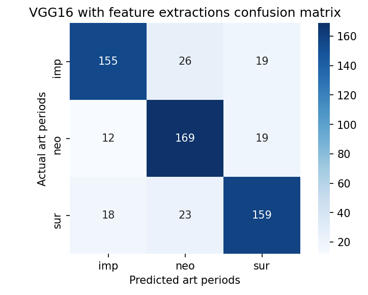

## Project MVP

I started off with a binary classification of Impressionism and Post-Impressionism paintings with 1,000 images per class. This model proved to be difficult and gave very poor metrics with little improvement with continual tuning-- I think due to the similarities in style with the two art periods, a basic CNN model had a hard time classifiying the two. I moved onto a new binary model with Surrealism and Neo-Classicism, initially using CNN, that gave me a train accuracy score of 0.838 and val score of 0.720. Image augmentation with both models made my model perform significantly worse, I believe due to the fact that classifiying paintings is so reliant on minute details and texture of the canvas. Applying a MobileNet model with dropout and no augmentation gave me a balanced model with 1.0 and 0.925 accuracy for train and val respectively. 

I moved onto a 3 class model, incorporating Impressionism paintings back into the fold, with 1,000 images per class. Applying a CNN model with ~3.5 million parameters and some dropout gave me a baseline score of 0.967 and 0.646 accuracy, indicating a lot of overfitting. Adding in more data for a total of 2,000 per class in addition to using VGG16 with feature extraction brought my val score up to 0.805. Accuracy seems to be the best metric to judge my dataset on as one target label is not more ideal than another -- one art period is not better than another since my model depends on whether or not I can accurately predict all genres, therefore precision/recall/F1 might not be as relevant to me.

Going forward, I would like to add in a few additional classes to my model and see if I am able to maintain relatively high scores with minimal overfitting. I would also like to explore fine tuning my transfer learning model to see if I can bring down the val loss. 

